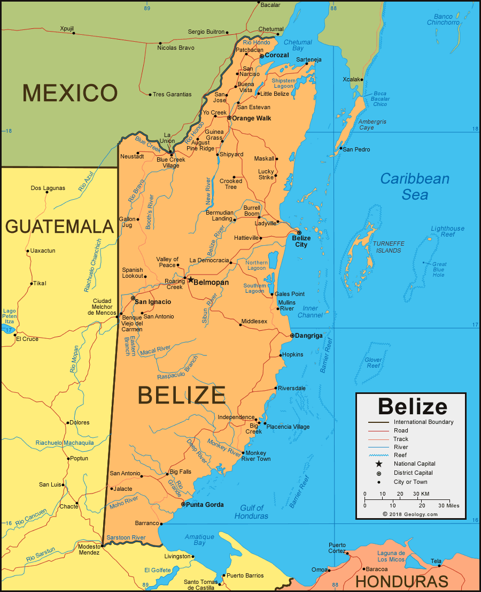

About Belize 
============

Belize is the only English-speaking country in Central America, and as a feature of its geographical location
and historical background, is a part of both Central America and the Caribbean. Bordered on the east by
the Caribbean Sea, on the north and north-west by Mexico, and on the west and south by Guatemala, Belize
lies between 15°45’ and 18°30’ north latitude, and 87°30’ and 89°15’ west longitude. The
country’s national territory is made up of 46,620 sq. km (18,000 sq. miles).

Belize is highly forested, with more than 50% of the mainland covered with forests, and the remaining land consisting mainly of agriculture, arable
land, and human settlements.

   Image source https://geology.com/world/belize-satellite-image.shtml

There are two main ecosystems that encompass Belize’s territory, the marine and the terrestrial ecosystem.
The marine ecosystem consists of open ocean, coral reefs and seagrass beds, while the terrestrial
ecosystem is made up of both broadleaf and pine forests along with several lakes and rivers in country.