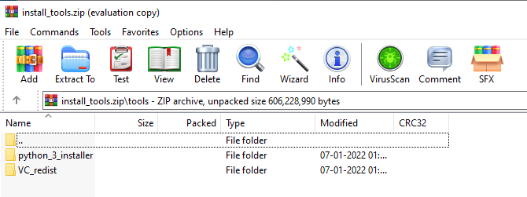

On Windows 
==========

Prerequisites
+++++++++++++

1. Clone the `GCBM Belize <https://github.com/moja-global/GCBM.Belize>`_ repository

2. Download the installation tools from releases: `install_tools <https://github.com/moja-global/GCBM.Belize/releases/tag/install_tools>`_, and unzip them into `Standalone_GCBM\tools` folder. On unzipping, `Standalone_GCBM\tools` will contain a folder tools with the folders `python_3_installer` and `VC_redist` .
The configuration is **strictly for Python3.7**, it will not work with other versions

Running the simulation (short version)
--------------------------------------

Navigate to `Standalone_GCBM\`, edit `run_all.bat` and set the `GCBM_PYTHON path` and `PLATFORM`` variables in the `USER CONFIGURATION` section near the top to the correct values for your system

Run `run_all.bat`, which performs the following preprocessing, and simulation

Running the project (long version)
----------------------------------

This involves running each stage of the simulation step by step. There are 12 steps in all. 
It helps in understanding the sequence of steps, inputs, outputs and dependencies to each step 

Step 1 
------

Working directory : **Standalone_GCBM\\layers\\tiled**

..  code-block:: bash
    :caption: Command

        c:\\python37\\python.exe ..\\..\\tools\\Tiler\\tiler.py

Description :  
    1. define all spatial layers needed for the simulation - can be raster or shapefile:
        - bounding box
        - age
        - classifiers
        - disturbance events (optional)
    2. crops all layers to a bounding box and reprojects to WGS84 processes layers into GCBM tile/block/cell format
    3. Output is a number of zip files containing GCBM-format data plus a json file containing metadata and an optional attribute table

Output : Logs written into **Standalone_GCBM\\logs\\tiler_log.txt**
  

Step 2 
------

Working directory : **Standalone_GCBM**

..  code-block:: bash
    :caption: Command

        tools\\Recliner2GCBM-x64\\Recliner2GCBM.exe -c input_database\\recliner2gcbm_config.json

Description : 

1. Runs the command-line version of Recliner2GCBM (`tools\Recliner2GCBM-[x86\x64]\Recliner2GCBM.exe`) on the saved project configuration made by running the GUI tool (Recliner2GCBM-GUI.exe)
2. Note: The paths in the saved `recliner2gcbm_config.json` file are relative to the location of the json file

Output : An SQLite database **gcbm_input.db** which contains all of the non-spatial data required to run the project parameters taken from a CBM3 ArchiveIndex database - disturbance matrices, default climate data, etc.

Step 3 
------
Working directory : **Standalone_GCBM**

..  code-block:: bash
    :caption: Command

        c:\\python37\\python.exe input_database\\add_species_vol_to_bio.py input_database\\gcbm_input.db

Description : Adding a generic tropical species and Vol to Bio parameters

Step 4
------
Working directory : **Standalone_GCBM**

..  code-block:: bash
    :caption: Command

        c:\\python37\\python.exe input_database\\modify_root_parameters.py input_database\\gcbm_input.db

Description : Modify root parameters 

Step 5
------
Working directory : **Standalone_GCBM**

..  code-block:: bash
    :caption: Command

        c:\\python37\\python.exe input_database\\modify_decay_parameters.py input_database\\gcbm_input.db

Description : Modify decay parameters 

Step 6
------
Working directory : **Standalone_GCBM**

..  code-block:: bash
    :caption: Command

        c:\\python37\\python.exe input_database\\modify_turnover_parameters.py input_database\\gcbm_input.db

Description : Modify turnover parameters

Step 7
------
Working directory : **Standalone_GCBM**

..  code-block:: bash
    :caption: Command

        c:\\python37\\python.exe input_database\\modify_spinup_parameters.py input_database\\gcbm_input.db

Description : Modify spinup parameters

Step 8
------

Working directory : **Standalone_GCBM\\gcbm_project**

..  code-block:: bash
    :caption: Command

        update_gcbm_configuration.bat

Description : 

1. Update the GCBM configuration
2. Automatically updates the GCBM configuration files based on the tiled layers:
    - scans for all of the tiled layers and adds them to the provider configuration file
    - sets the tile, block, and cell size in the config files so that the model knows the overall resolution of the simulation (the lowest common denominator of all the tiled layer resolutions)
    - updates the list of disturbance layers in the simulation based on the DisturbanceLayer items in tiler.py
    - updates the initial classifier set with the classifier layers tagged in tiler.py

Output :  Logs generated in `Standalone_GCBM\\logs\\update_gcbm_config.log`

Step 9
------
Working directory : **Standalone_GCBM\\gcbm_project**

..  code-block:: bash
    :caption: Command

        run_gcbm.bat

Description : 

1. Run the GCBM model
2. Project configuration is split between multiple files listed in `gcbm_project\\gcbm_config.cfg`
3. Data source configuration (spatial layers + SQLite) is in `gcbm_project\\provider_config.json`

- Output : Logs generated in `Standalone_GCBM\\logs\\Moja_Debug.log`

Step 10
-------

Working directory : **Standalone_GCBM\\tools\\CompileGCBMSpatialOutput**

..  code-block:: bash
    :caption: Command

        create_tiffs.bat

Description : 

1. Compile the spatial output
2. Generates tiff layers from raw GCBM spatial output

Output : 

1. A tiff layer per indicator and timestep in `processed_output\\spatial`
2. Logs written into `Standalone_GCBM\\logs\\create_tiffs.log`

Step 11
-------

Working directory : **Standalone_GCBM\\tools\\CompileGCBMResults**

..  code-block:: bash
    :caption: Command

        compileGCBMResults.bat

Description : 

1. Compile the GCBM results
2. Turns the raw GCBM output database into a more user-friendly format containing most of the familiar indicators from the CBM3 Toolbox
3. Produces `processed_output\\compiled_gcbm_output.db`